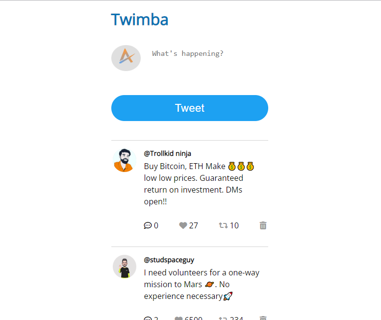

# Twimba
 
 ## Table of Content

 * [Overview of the Project](#overview-of-the-project)
      * [Screenshot](#screenshot)
 * [Technologies I Used](#technologies-i-used)
 * [What I Learned](#what-i-learned) 
 
# Overview of the Project

Twimba is a web application which works on the functionalities of twitter app but with my own design and consist of the following features :-
- Like or unlike a tweet.
- Retweet a tweet.
- Reply to a particular tweet.
- Add your own Tweet.
- Delete a tweet.
- Delete a reply of a tweet.

## Screenshot

## Technologies I Used
* Semantic HTML5
* CSS
* Vanilla Javascript

## What I Learned

- Learned how to pass data using forEach.
- Learned about data attributes.
- Learned how to conditionally render styles in JS.
